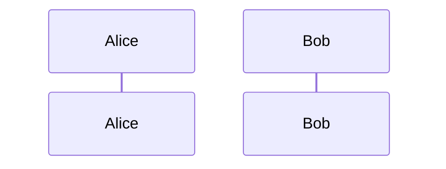
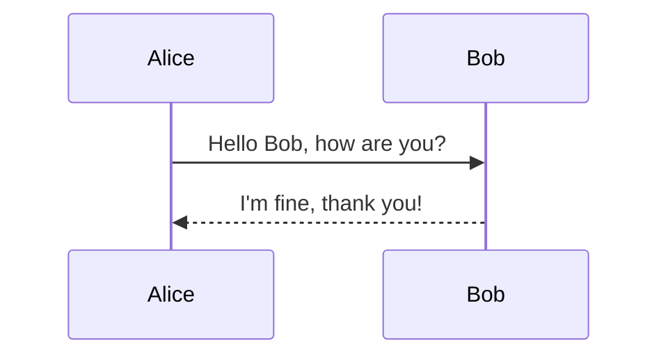
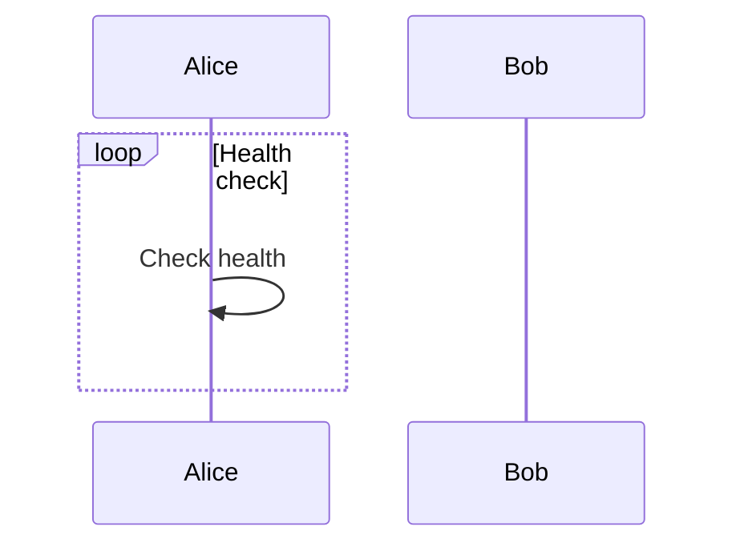
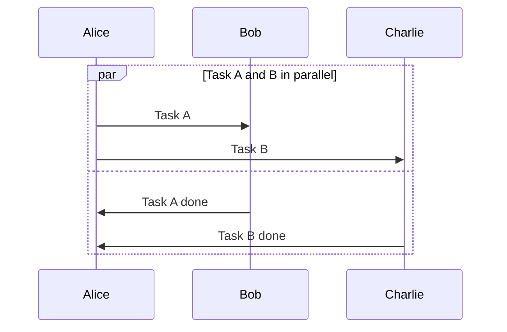
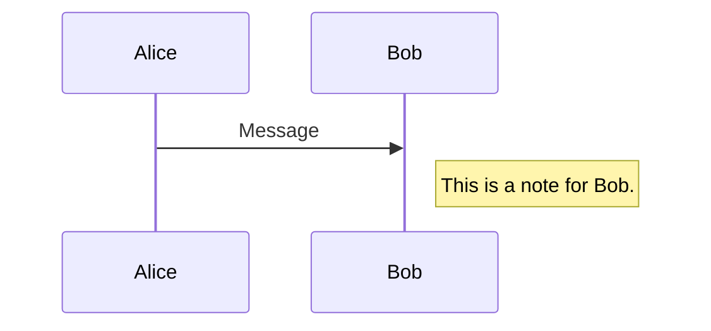
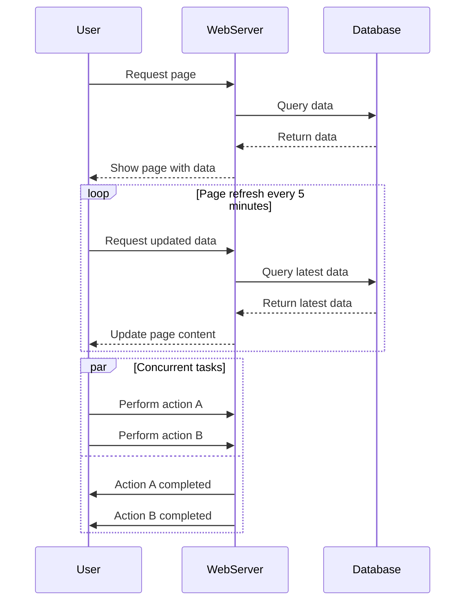

​	Mermaid 提供了一套简单且直观的语法，用于定义时序图（Sequence Diagram）。以下是 Mermaid 语法中一些关键元素和概念，以及如何使用它们来创建一个时序图。

### 基础语法

#### 开始与结束

时序图的定义以 `sequenceDiagram` 关键字开始。不需要显式的结束标记，因为代码块中的内容即为图表定义。

```mermaid
sequenceDiagram
```

#### 参与者（Participant）

参与者是时序图中的角色，通常表示系统、人或其他实体。你可以通过 `participant` 关键字来声明参与者。



#### 消息（Message）
消息是参与者之间的交互，用箭头表示。基本格式如下：

- `->>`：实线箭头，表示同步消息。
- `-x`：实线叉号，表示异步消息。
- `-->>`：虚线箭头，表示返回消息或异步响应。
- `--x`：虚线叉号，表示异步错误或异常。



#### 循环（Loop）
你可以使用 `loop` 和 `end` 来定义循环结构，这在需要表示重复动作时非常有用。



#### 并发（Parallel）
并发分支可以用 `par` 和 `and` 定义，最后用 `end` 结束并发段。



#### 注释（Note）

可以添加注释来解释图表中的某些部分。使用 `note left of`、`note right of` 或 `note over` 来放置注释。



### 示例

这里是一个更完整的时序图示例，包含了上述多个元素：



以上就是 Mermaid 语法的基本介绍。根据你的需求，你可以组合这些元素来构建复杂的时序图。如果你有特定场景或者想要实现的功能，请告诉我，我可以提供更加具体的帮助。