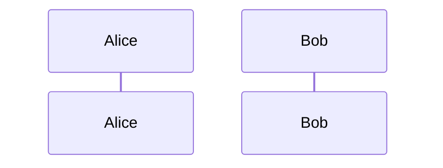
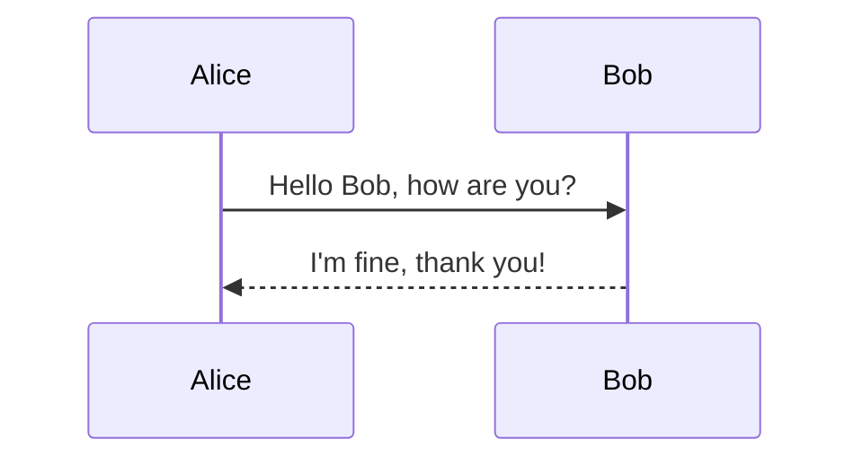
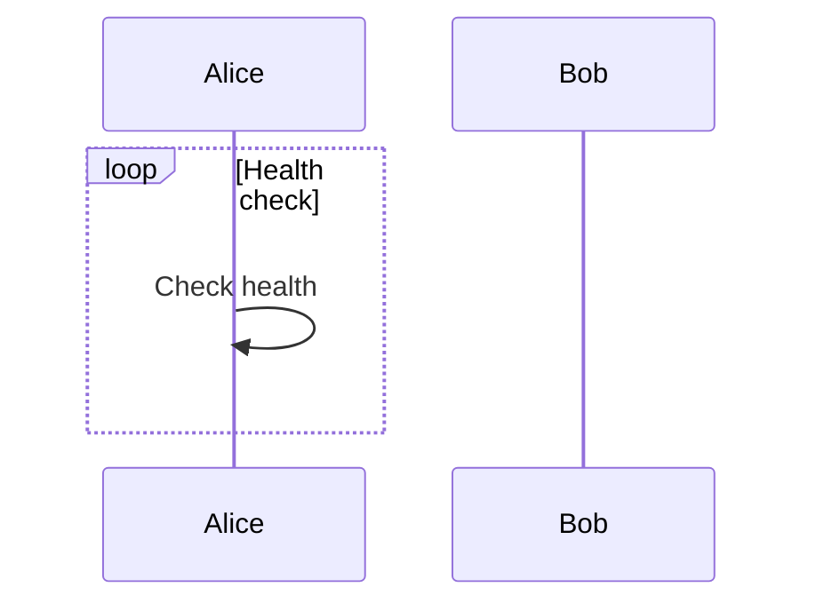
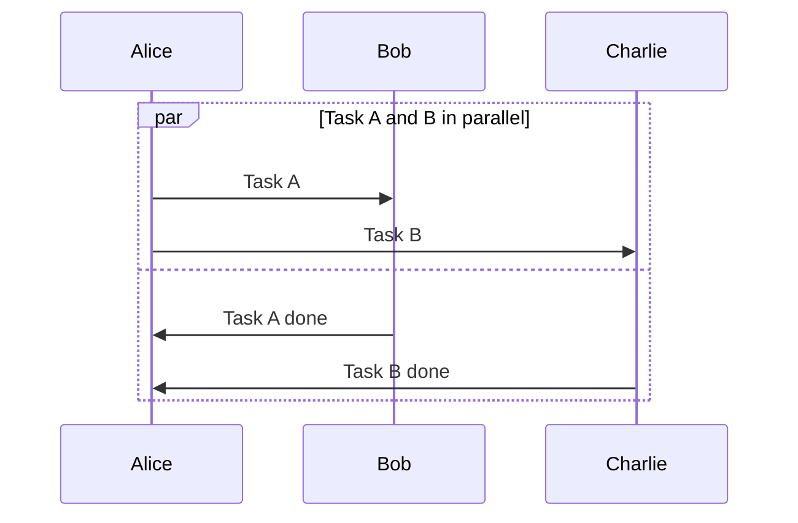
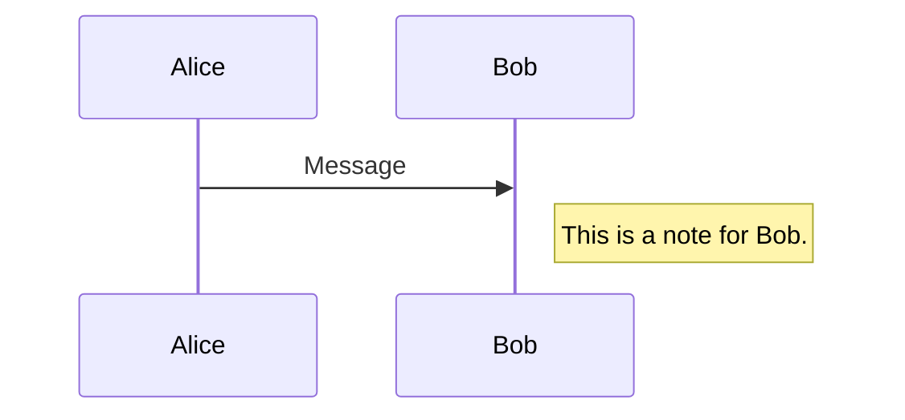
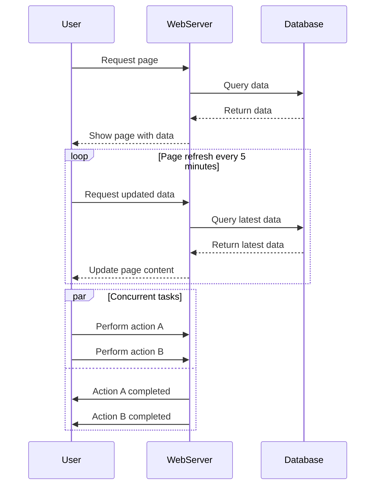
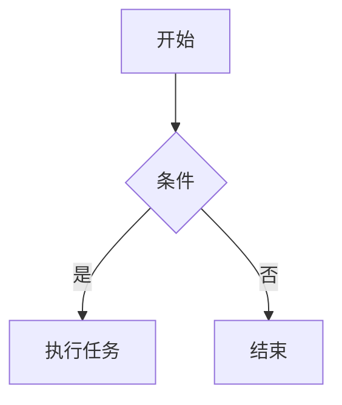
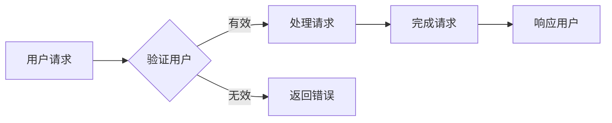
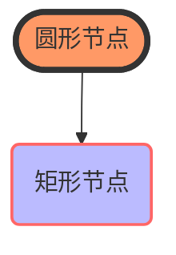
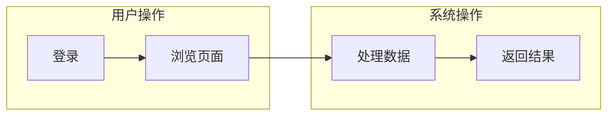

	Mermaid 提供了一套简单且直观的语法，用于定义时序图（Sequence Diagram）。以下是 Mermaid 语法中一些关键元素和概念，以及如何使用它们来创建一个时序图。

### 基础语法

#### 开始与结束

时序图的定义以 `sequenceDiagram` 关键字开始。不需要显式的结束标记，因为代码块中的内容即为图表定义。

```mermaid
sequenceDiagram
```

#### 参与者（Participant）

参与者是时序图中的角色，通常表示系统、人或其他实体。你可以通过 `participant` 关键字来声明参与者。



#### 消息（Message）
消息是参与者之间的交互，用箭头表示。基本格式如下：

- `->>`：实线箭头，表示同步消息。
- `-x`：实线叉号，表示异步消息。
- `-->>`：虚线箭头，表示返回消息或异步响应。
- `--x`：虚线叉号，表示异步错误或异常。



#### 循环（Loop）
你可以使用 `loop` 和 `end` 来定义循环结构，这在需要表示重复动作时非常有用。



#### 并发（Parallel）
并发分支可以用 `par` 和 `and` 定义，最后用 `end` 结束并发段。



#### 注释（Note）

可以添加注释来解释图表中的某些部分。使用 `note left of`、`note right of` 或 `note over` 来放置注释。



### 示例

这里是一个更完整的时序图示例，包含了上述多个元素：



以上就是 Mermaid 语法的基本介绍。根据你的需求，你可以组合这些元素来构建复杂的时序图。如果你有特定场景或者想要实现的功能，请告诉我，我可以提供更加具体的帮助。


Mermaid 是一种用于生成图表的简单标记语言，特别适合在 Markdown 文件中使用。它支持多种类型的图表，包括流程图、时序图、类图等。以下是 Mermaid 语法中所有与流程图相关的元素和指令的简要概述：

### 流程图语法

#### 基本结构

```bash
graph 方向;
    节点1 --> 节点2;
```

- **`graph`**：定义一个图表。
- **方向**：指定图表的方向，可以是 `TB`（从上到下）、`BT`（从下到上）、`LR`（从左到右）或 `RL`（从右到左）。

#### 定义节点

- **矩形节点**：`A[矩形标签]`
- **圆形节点**：`B((圆形标签))`
- **菱形决策节点**：`C{菱形标签}`
- **子图**：`subgraph 标题; ... end`

#### 连接节点

- **普通边**：`A --> B`
- **带标签的边**：`A -->|标签| B`
- **不同类型的边**：
  - 实线箭头：`-->`
  - 虚线箭头：`-.->`
  - 点线箭头：`-.->`
  - 双向箭头：`<-->`
  - 点线双向箭头：`-.<->.`
  - 无箭头：`---`

#### 设置样式

```bash
style 节点ID fill:#颜色,stroke:#颜色,stroke-width:宽度px
```

例如：

```bash
style A fill:#f96,stroke:#333,stroke-width:4px
```

### 示例

#### 简单流程图



#### 复杂流程图



#### 带有样式的流程图



#### 子图



### 其他特性

- **注释**：使用双斜杠 `//` 添加注释。
  
  ```bash
  graph TD;
      A[开始] --> B{条件}; // 这是一个注释
      B -->|是| C[执行任务];
  ```

- **链接**：可以在节点中添加超链接。

  ```bash
  graph TD;
      A[点击这里](https://example.com) --> B[目标页面];
  ```

### 总结

Mermaid 提供了简洁而强大的语法来创建各种类型的图表，特别是流程图。通过组合不同的节点类型、边类型和样式设置，你可以创建清晰、美观且易于理解的流程图。如果你有更多具体问题或需要进一步的帮助，请随时告知！

颜色名称	十六进制颜色代码	RGB 颜色代码
白色 (White)	#FFFFFF	rgb(255, 255, 255)
黑色 (Black)	#000000	rgb(0, 0, 0)
红色 (Red)	#FF0000	rgb(255, 0, 0)
绿色 (Green)	#008000	rgb(0, 128, 0)
蓝色 (Blue)	#0000FF	rgb(0, 0, 255)
黄色 (Yellow)	#FFFF00	rgb(255, 255, 0)
橙色 (Orange)	#FFA500	rgb(255, 165, 0)
紫色 (Purple)	#800080	rgb(128, 0, 128)
粉色 (Pink)	#FFC0CB	rgb(255, 192, 203)
棕色 (Brown)	#A52A2A	rgb(165, 42, 42)
灰色 (Gray)	#808080	rgb(128, 128, 128)
浅灰色 (Light Gray)	#D3D3D3	rgb(211, 211, 211)
深灰色 (Dark Gray)	#A9A9A9	rgb(169, 169, 169)
青色 (Cyan)	#00FFFF	rgb(0, 255, 255)
浅蓝色 (Light Blue)	#ADD8E6	rgb(173, 216, 230)
淡黄色 (Light Yellow)	#FFFFE0	rgb(255, 255, 224)
淡绿色 (Light Green)	#90EE90	rgb(144, 238, 144)
淡红色 (Light Coral)	#F08080	rgb(240, 128, 128)
淡紫色 (Lavender)	#E6E6FA	rgb(230, 230, 250)