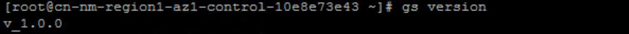
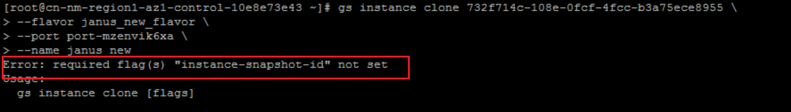
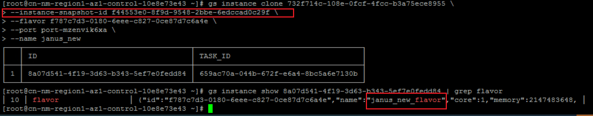

# 工作内容

## 修复clone时总使用源虚机规格问题

bug：无法指定规格flavor进行clone，clone实例会沿用源主机的的规格

工作内容：

1. 修复该bug
2. 编写单元测试
3. 验证新逻辑clone功能
4. 编写测试报告

```bash
│  130 │ d7ab4c91-deca-c226-20f1-8b95b46be5e2 │ s2.medium.2                                            │    1 │ 2GiB     │      │ 2024-10-23 16:00:51 │
```

```bash
| a8532cd4-f987-4c81-83cf-a80e1b71e8e6 | Ctyunos-2.0.1_yunyi-x86_64-221222 
```

```bash
| port-aqrqxf4qe9 | subnet-hxki23w8f2 | fa:16:3e:cd:85:f7 | 10.112.1.6       | []                            |                                      | primary | vpc-u550lmlwkh | 001a18cadd4b401e9fdeab6c411d9816 | unset  

#  vpcs  port-list  --tenant-id 001a18cadd4b401e9fdeab6c411d9816 --limit 100 | grep unset
```


```bash
gs instance boot \
--flavor 8d0e3bec-7729-e6eb-9cba-f20df480581a \
--image a8532cd4-f987-4c81-83cf-a80e1b71e8e6 \
--host 23d752acc3284677ac00e5320aa8633adfd25ca5 \
--zone SERIES-7-ZONE  \
--name janus \
--port port-aqrqxf4qe9 \
--password janus \
--volume-size 50


gs instance boot \
--flavor janus_old_flavor \
--image a8532cd4-f987-4c81-83cf-a80e1b71e8e6 \
--host 23d752acc3284677ac00e5320aa8633adfd25ca5 \
--zone SERIES-7-ZONE  \
--name janus_old \
--port port-aqrqxf4qe9 \
--password janus \
--volume-size 50
```

```bash
 project_id            │ 001a18cadd4b401e9fdeab6c411d9816  
```

```bash
gs flavor create \
--core 1 \
--memory 2G \
--spec "DISK:VOLUMES_QUOTA"="8","hw:support_live_resize"="true","hw:numa_nodes"="2" \
--multi_queue 1 \
--name janus_s2.medium.2_a
```

```bash
gs instance clone 732f714c-108e-0fcf-4fcc-b3a75ece8955 \
--instance-snapshot-id f44553e0-8f9d-9548-2bbe-6edccad0c29f \
--flavor janus_new_flavor \
--port port-mzenvik6xa \
--name janus_new

gs instance clone 732f714c-108e-0fcf-4fcc-b3a75ece8955 \
--instance-snapshot-id f44553e0-8f9d-9548-2bbe-6edccad0c29f \
--flavor f787c7d3-0180-6eee-c827-0ce87d7c6a4e \
--port port-mzenvik6xa \
--name janus_new

gs instance clone 732f714c-108e-0fcf-4fcc-b3a75ece8955 \
--flavor janus_new_flavor \
--port port-mzenvik6xa \
--name janus_new  
```

```bash
gs instance snapshot-create 732f714c-108e-0fcf-4fcc-b3a75ece8955 --name janus --force-consistency true
```


1. 查看gs版本

   

2. 创建虚拟机

   

3. 直接克隆

   

4. 创建快照

5. 指定快照克隆查看结果

   

   结论：gs v_1.0.0 不支持直接克隆虚拟机，需要指定快照，指定快照后规格正确切换
