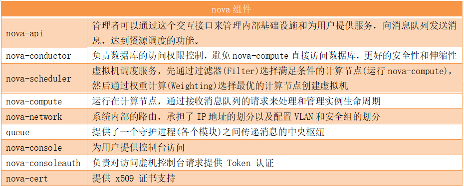
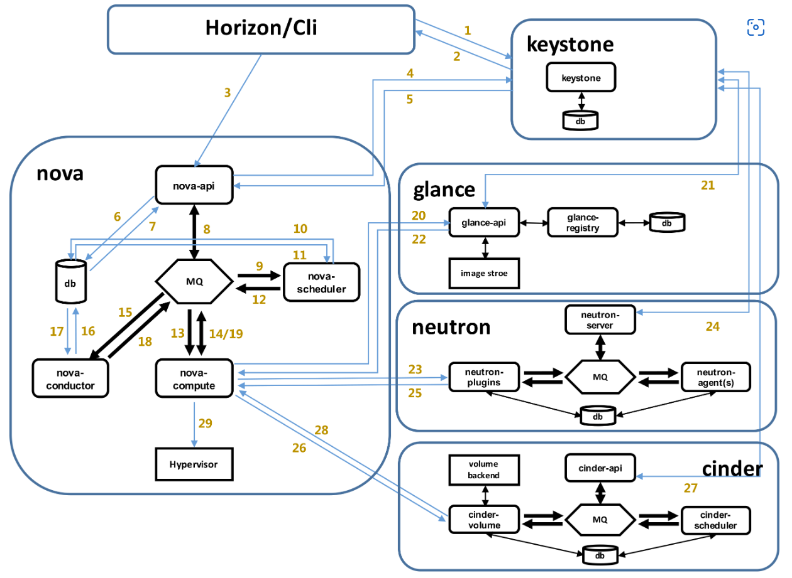
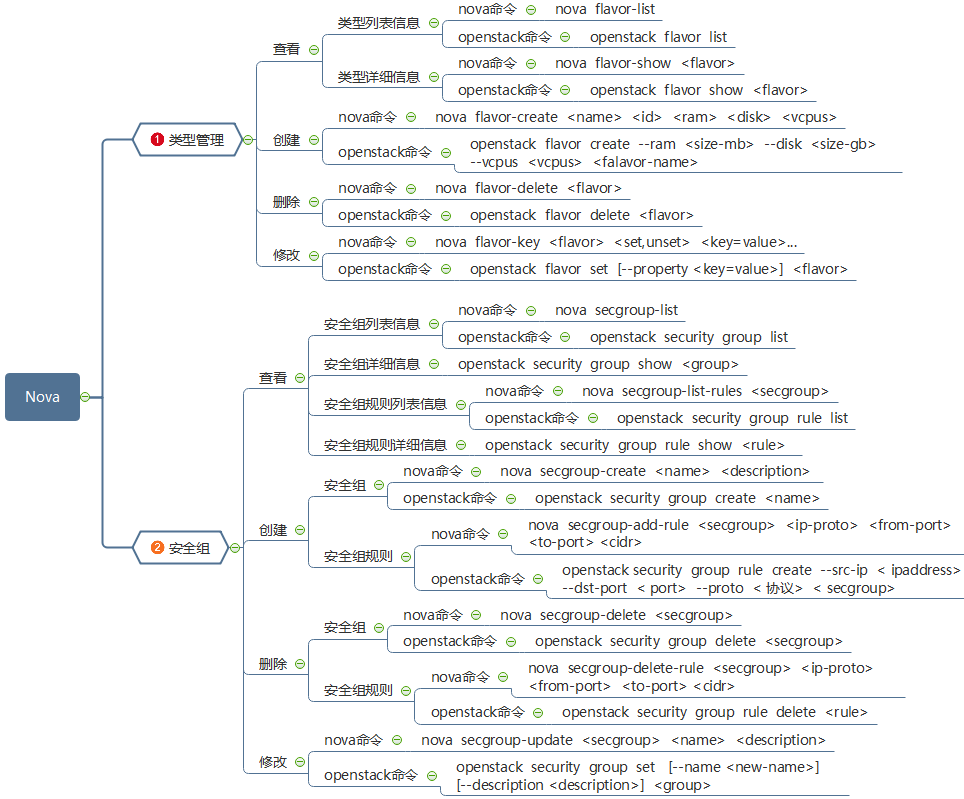
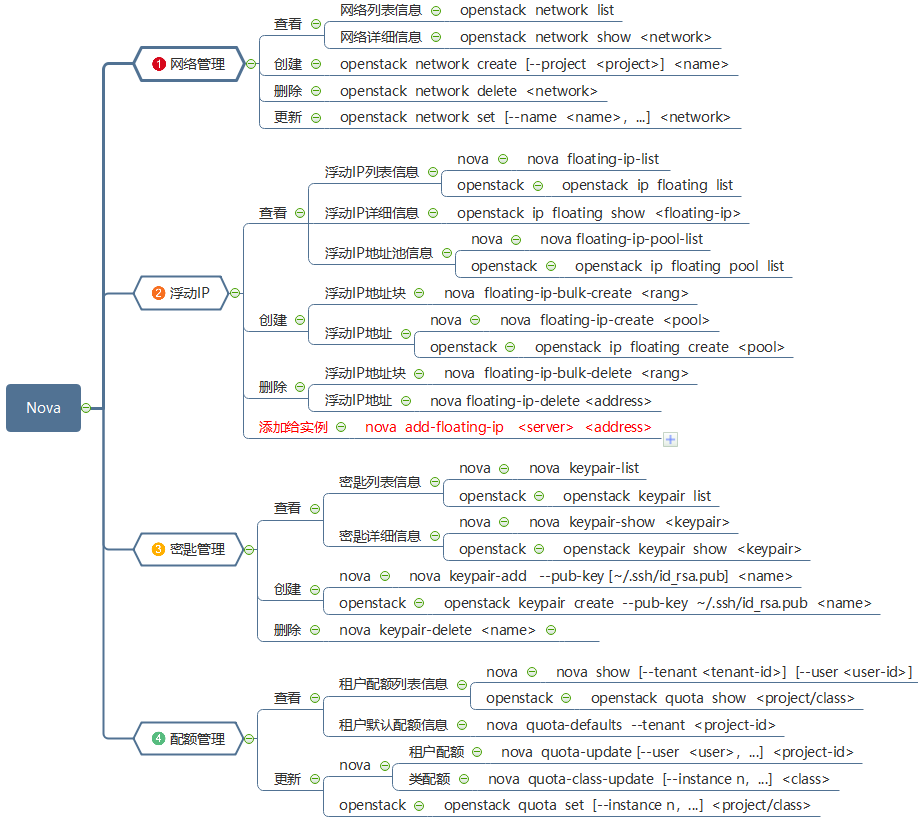

# 云计算服务模型

- **IaaS（Infrastructure as a Service）**：提供基础计算资源，用户管理操作系统及之上的一切。
- **PaaS（Platform as a Service）**：提供开发和部署平台，用户管理应用程序和数据。
- **SaaS（Software as a Service）**：提供完整应用程序，用户直接使用应用程序。
- **FaaS（Functions as a Service）**：提供无服务器计算服务，用户上传代码片段按需执行。
- **DaaS（Data as a Service）**：提供数据管理和分析服务，用户访问和使用数据。
- **CaaS（Containers as a Service）**：提供容器管理服务，用户管理容器化的应用程序。

# openStack

​	OpenStack是一个云操作系统，通过数据中心可控制大型的计算、存储、网络等资源池。所有的管理通过前端界面管理员就可以完成，同样也可以通过web接口让最终用户部署资源。

- Keystone(认证服务) :  OpenStack 的身份认证服务，提供了一个集中的身份验证机制，支持多种身份验证方法，包括用户名和密码、API 密钥、OAuth 和令牌。
- Glance(镜像服务): 管理虚拟机镜像，提供了一个注册表服务，用户可以查询和检索虚拟机镜像，这些镜像用于创建新的虚拟机实例。
- Nova(计算服务): 是 OpenStack 的计算组件，负责管理虚拟机实例的生命周期，包括创建、调度、迁移和销毁虚拟机。它支持多种虚拟化技术，如 KVM、Xen 和 VMware。
- Neutron(网络服务): 提供虚拟网络基础设施的功能，使用户能够创建和管理网络连接，支持各种网络拓扑和服务，如防火墙、负载均衡和虚拟专用网络（VPN）。
- Cinder(块储存服务): 提供持久性的块存储服务，用于创建和管理虚拟磁盘，这些磁盘可以附加到虚拟机上，提供额外的存储空间。
- Swift(对象存储服务): 提供了一个可扩展的、冗余的对象存储系统，用于存储非结构化的数据，如图片或视频文件。
- Heat(编排服务): 一个编排引擎，允许用户定义和管理复杂的云应用，通过模板描述应用的资源需求和依赖关系，Heat 自动化资源的创建和配置过程。
- Trove(数据库服务): 提供了一个数据库即服务的解决方案，使用户能够轻松地管理和部署关系型数据库。

## nova

- 概念

1. Nova和Swift是OpenStack最早的两个组件，nova分为控制节点和计算节点。
2. 计算节点通过Nova Compute进行虚拟机创建，通过libvirt调用kvm创建虚拟机，nova之间通信通过rabbitMQ队列进行通信。
3. Nova位于Openstack架构的中心，其他服务或者组件（比如Glance、Cinder、Neutron等）对它提供支持，另外它本身的架构也比较复杂。

- 作用

1. Nova是OpenStack最核心的服务模块，负责管理和维护云计算环境的计算资源，负责整个云环境虚拟机生命周期的管理。
2. Nova是OpenStack的计算服务，负责维护和管理的网络和存储，提供计算服务。

- 组件

  

### 工作流程

# Libvirt

​	Libvirt是一个开源项目，提供了一组API、工具、库，用于管理和控制虚拟化平台。
​	在Openstack环境中，Libvirt是一个至关重要的组件，它为各种虚拟化技术（如 KVM、QUME、Xen和LXC）提供统一的接口，使得Openstack能够和底层虚拟化技术进行交互。

- Libvirt 主要功能包括：
  1. API提供：Libvirt 提供一个C语言的API，同时也支持多种高级编程语言的绑定。这些API允许开发者编写应用程序来创建、配置和管理虚拟机。
  2. 虚拟化管理接口：Libvirt 提供了一个统一的接口，可以透明地处理不同的虚拟化技术。这意味着Openstack不需要知道具体的虚拟化实现，而是通过libvirt进行操作，简化了开发和维护工作。
  3. 安全隔离：Libvirt 支持安全策略，确保各个虚拟机之间的隔离，提高系统的安全性。
  4. 资源管理：Libvirt 可以控制和调整虚拟机的资源分配，包括CPU、内存、磁盘和网络。这对于优化虚拟化环境中的资源利用率至关重要。
  5. 网络管理：Libvirt 提供了网络抽象层，能够创建和配置网络桥联、网络过滤器等，支持虚拟网络设备的管理。
  6. 存储管理：Libvirt 支持多种存储类型，如块设备、文件系统、网络存储，以及Openstack中的Cinder存储服务。

- Openstack中，Libvirt 主要与以下服务交互：
  1. nova：作为Openstack计算服务，nova 通过调用 Libvirt 的API来执行这些操作，包括创建、启动、停止和迁移虚拟机实例。
  2. neutron：Openstack网络服务 neutron 可以利用Libvirt 来配置虚拟网络，如设置网络连接、端口安全规则和负载均衡。
  3. cinder：cinder 直接与后端存储系统交互，但 Libvirt 参与了卷的挂载和卸载，以及在虚拟机内部使用的cinder卷。

 	Libvirt 还包含了一些命令行工具，如virsh 等，允许管理员直接对虚拟机进行操作，如查看状态、编辑配置、挂载磁盘等。Libvirt 是 Openstack 架构中的关键组件，它作为中间层连接上层服务和底层虚拟化技术，提供高效、灵活和安全的虚拟化管理能力。

## virsh 命令

| 命令                           | 作用                  |
| ------------------------------ | --------------------- |
| virsh list --all               | 列出所有虚拟机        |
| virsh start <domain-name>      | 启动虚拟机            |
| virsh shutdown <domain-name>   | 关闭虚拟机            |
| virsh destroy <domain-name>    | 强制关闭虚拟机        |
| virsh reboot <domain-name>     | 重启虚拟机            |
| virsh suspend <domain-name>    | 暂停虚拟机            |
| virsh resume <domain-name>     | 恢复虚拟机            |
| virsh dumpxml <domain-name>    | 查看虚拟机详细信息    |
| virsh define <xml-file>        | 创建虚拟机            |
| virsh undefine <domain-name>   | 删除虚拟机            |
| virsh domstate <domain-name>   | 查看虚拟机状态        |
| virsh vncdisplay <domain-name> | 查看虚拟机的 VNC 端口 |

# QGA（Qemu Guest Agent）

- 定义与作用：
  1. QGA是一个运行在虚拟机内部的普通应用程序（可执行文件名称默认为qemu-ga，服务名称默认为qemu-guest-agent）。
  2. 其主要目的是实现宿主机和虚拟机之间的一种不依赖于网络的交互方式，而是依赖于virtio-serial（默认首选方式）或者isa-serial。
  3. QGA通过读写串口设备与宿主机上的socket通道进行交互，交互的协议与QMP（QEMU Monitor Protocol）相同，即使用JSON格式进行数据交换。

- 功能特点：
  1. QGA提供了虚拟机内部状态信息（如文件系统信息、网络信息等）的查询和修改能力。
  2. 它可以执行一些宿主机发起的操作，如文件操作、磁盘管理、网络配置等。
  3. QGA的功能扩展较为方便，开发者可以通过修改源码来添加新的命令或功能。

 
