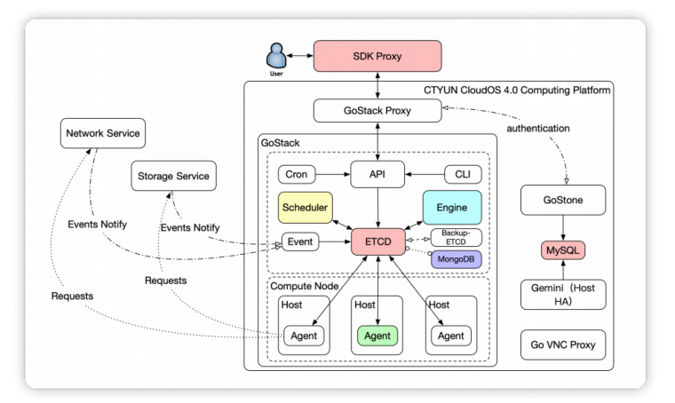
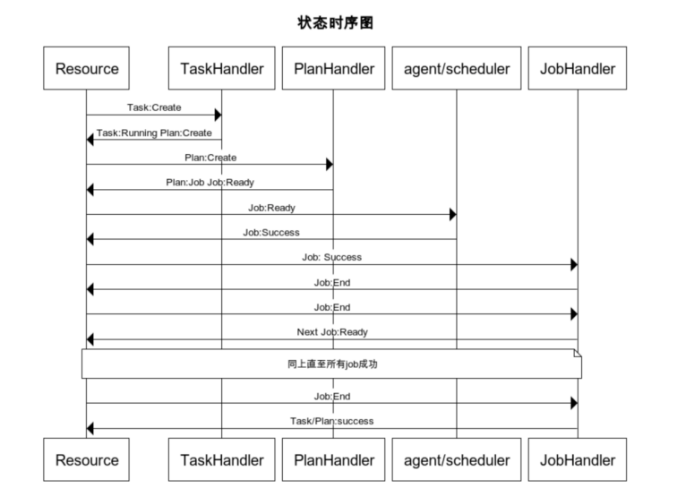
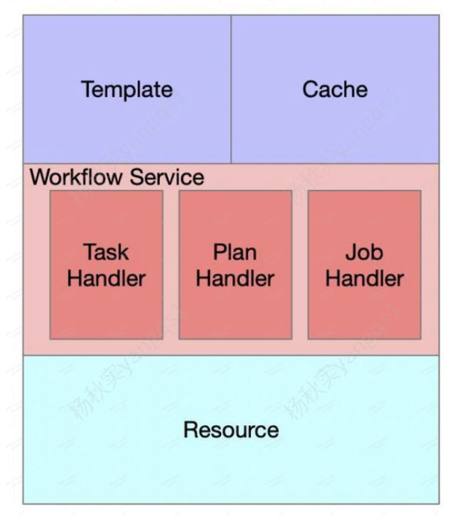
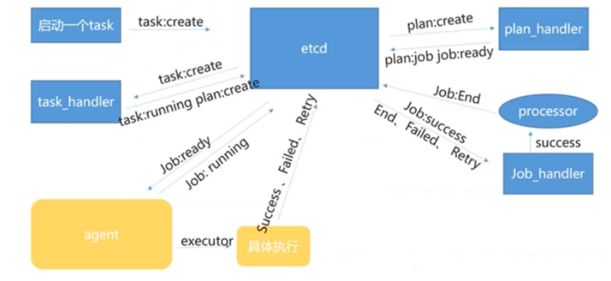

# 项目结构

```bash
gostack
├── agent
├── api
├── benchmark
├── build
├── cmd
├── common
├── cron
├── devops
├── devops-build
├── engine
├── event
├── log
├── main
├── metadata
├── scheduler
├── scripts
└── test
```


# 框架和组件功能



| 组件          | 功能                                                         |
| ------------- | ------------------------------------------------------------ |
| Agent         | 计算节点常驻程序，负责在计算节点执行任务 ，上报宿主机、虚拟机状态 |
| API           | 提供RESTfuI接口供前端调用、基础数据增删改查功能、将前端请求处理成Task并记录至数据库 |
| Engine        | 核心编排引擎，监听并处理Task执行异步处理流程                 |
| DTCD          | 存储数据，通过watch机制同步状态                              |
| Scheduler     | 调度引擎，负责处理资源调度                                   |
| Cron          | 周期性任务注册、执行组件                                     |
| Event         | 对接存储、网络外部事件驱动                                   |
| GoStack Proxy | 将SDK Proxy请求转换为GoStack API                             |
| SDK Proxy     | 云管平台上层与底层API交互转换层                              |
| GoStone       | 平台组件鉴权平台                                             |
| Go VNC Proxy  | VNC转发建联组件                                              |
| Gemini        | 宿主机HA，故障检测、隔离、恢复平台                           |

时序图







# 运行流程

1. 加载配置文件,初始化读取template
2. 上报健康状态
3. 加载已有数据并构建缓存（cache）
4. 开启事件监听服务(workflow_service)
   - WatchEvent（重点）

# 业务数理

## 虚拟机快照

- 接口
  - 获取虚拟机快照列表 
  - 获取虚拟机快照信息

- 小缺陷

  - swag关于接口描述的注解，表达不清晰。

    

### 获取虚拟机快照列表

- 流程：从mongo获取快照信息
- 疑问：快照信息存入的时机待探索

### 获取虚拟机快照信息


## 创建虚拟机

1. 请求体数据校验与绑定
   1. body是否存在，否--return err
   2. config_drive是否存在，否--ConfigDrive = true
   3. password 校验，无 --随即生成
   4. createInstanceRequest 格式校验(validate)
   5. Metadata校验
   6. 是否有name，无 name = hostname
   7. 处理网络，不支持pf网卡
2. keypair检查
3. 查找flavor
4. 创建虚拟机
5. 提交事务


# gostack项目运转流程

1. 结构
   - agent : 执行Job
   - api : 前端请求处理成Task并记录至数据库
   - engine : 监听并处理Task执行异步处理流程
   - scheduler : 负责处理资源调度
   - cron : 周期性任务注册、执行组件
   - 元数据服务meta
   - 

模块之间是通过 etcd 的 watch 机制来时间进行模块之间的交互，实现类似远程调用的效果。

- 流程
  1. api模块根据请求，决定是否需要需要生成task
  2. engine模块
     1. 根据FlowName进行job编排，生成plan，以及决定是否需要scheduler进行调度
     2. plan下每个jod在agent 执行，返回结果
     3. task、plan、jod执行过程的相关数据同步到etcd
     4. 有job有错误，直接返回错误响应，全部执行成功则返回成功响应
  3. agent执行jod, 


# gs

```bash
gs [command] [flag]

Available Commands:
  config               show configs
  cron                 cron commands
  dash                 show dashboard
  dedicated-cloud      dedicated cloud commands
  flavor               flavor commands
  help                 Help about any command
  host                 host commands
  inner-migrate-policy inner-migrate-policy commands
  instance             instance commands
  job                  job commands
  keypair              keypair commands
  power                power commands
  scheduler            scheduler commands
  scheduler-policy     scheduler-policy commands
  server-group         server-group commands
  tag                  tag commands
  task                 task commands
  token                issue token
  version              show the version number
  zone                 zone commands
  
Flags:
  -h, --help   help for gs
```

## instance

```bash
gs instance [command] [flag]

Available Commands:
  attach-interface            attach instance interface
  attach-usb-device           attach instance usb device
  attach-volume               attach instance volume
  backup                      creating a backup of instance
  backup-abort                Abort the instance backup
  backup-delete               Delete the instance backup
  backup-list                 list all instanceBackups
  backup-reset                reset instanceBackup status to completed
  backup-show                 Query the backup function of a instance
  backup-update               update a backup of instance
  boot                        boot a new instance
  check-install-status        check software install status
  clone                       clone a instance
  create-instance-image       creating a image of instance
  create-spec-metadata        create instance spec meta-data
  delete                      delete instance
  delete-spec-metadata        delete instance spec meta-data
  detach-interface            detach instance interface
  detach-usb-device           detach instance usb device
  detach-volume               detach instance volume
  estimate-migration-time     estimate live migration time
  evacuate                    evacuate instance
  get-spec-metadata           get instance spec meta-data
  hostname                    change instance hostname
  install-disaster-recovery   install disaster recovery client
  interface-list              list instance interfaces
  list                        list all instances
  live-migrate                live migrate instance
  live-migrate-volume         live migrate volume
  live-migration-abort        abort instance live migration job
  localdisk-show              show instance localdisk info
  log                         show instance console log
  migrate                     migrate instance
  migrate-confirm             confirm migrate instance
  migrate-revert              revert migrate instance
  migrate-stop-delete         Delete the migrate due to stop task by instance-id
  migrate-stop-list           list migrate instances due to stop
  migration-list              list migrations
  password                    change instance password
  pause                       pause instance
  reboot                      reboot instance
  rebuild                     rebuild a instance
  rescue                      Enter rescue mode for instance
  reset                       reset instance status to active
  resize                      resize instance
  resize-confirm              confirm resize instance
  resize-revert               revert resize instance
  restore                     restore instance
  resume                      resume instance
  shelve                      shelve instance
  show                        show instance info
  show-deleted                show deleted instance info
  snapshot-create             creating a snapshot of instance
  snapshot-create-image       creating a image of instance snapshot
  snapshot-delete             Delete the instance snapshot
  snapshot-list               list all instanceSnapshots
  snapshot-reset              reset instanceSnapshot status to available
  snapshot-restore            restore instance by Snapshot
  snapshot-show               show the snapshot details of a instance snapshot
  snapshot-update             update a snapshot of instance
  start                       start instance
  stop                        stop instance
  suspend                     suspend instance
  sync                        sync instance
  uninstall-disaster-recovery uninstall disaster recovery client
  unpause                     unpause instance
  unrescue                    Exit rescue mode for instance
  unshelve                    unshelve instance
  update                      update a instance
  update-configuration        update instance configuration
  update-spec-metadata        update instance spec meta-data, when force is true, the origin meta will be cover.
  vnc                         show instance vnc info
  vncreset                    reset instance vnc password

Flags:
  -h, --help   help for instance

```

### boot

```bash
gs instance boot \
--flavor s7.small.1 \
--image 65639384-7cc3-4d9d-bf44-c9161ebd3d26  \
--host 23d752acc3284677ac00e5320aa8633adfd25ca5 \
--zone SERIES-7-ZONE  \
--name janus \
--port port-ustdivjyb0 \
--password janus \
--volume-size 50
```

```bash
Usage:
  gs instance boot [flags]

Flags:
      --config-drive                 need config drive to boot instance(etc. --config-drive=false) (default true)
      --count int                    count to boot instance
      --debug                        debug
      --dedicated_to string          dedicated cloud to boot instance
      --destType string              destType of system block. eg: --destType local
      --flavor string                flavor id of instance
      --group strings                server groups to boot instance
  -h, --help                         help for boot
      --host string                  which host to boot instance
      --image string                 image id of instance
      --instance-uuid string         create instance with specified UUID
      --is-pgpu-install              need install  the driver and installation package for pgpu
      --is-trusted                   need create trusted instance
      --json                         show json response
      --key-name string              keypair name to boot instance
      --metadata stringToString      metadata (default [])
      --name string                  display name for instance
      --network string               network id of instance (either-or port id)
      --only-define                  only define vm. eg: --only-define
      --password string              password for instance
      --pci-types strings            pass in pci type data in the form of slice, enter "" defaults to type-VF, enter reference value: type-VF
      --pf-names strings             pass in pf name in the form of slice, default is "". eg: "",eno1
      --pgpu-driver-kits string      driver and installation package for pgpu
      --port string                  port id of instance (either-or network id)
      --ports strings                pass in port data in the form of slice. eg: port-1,port-2
      --security-group-ids strings   security group ids to boot instance
      --sourceType string            sourceType of system block. eg: --sourceType local
      --user-data string             user data to boot instance
      --volume string                volume id of instance
      --volume-size int              volume size to boot instance
      --zone string                  which AZ to boot instance
```

### clone

```bash
Usage:
  gs instance clone <instance_id> [flags]
  
Flags:
      --config-drive                  need config drive to boot instance(etc. --config-drive=false) (default true)
      --count int                     count to boot instance
      --debug                         debug
      --flavor string                 flavor id of instance
      --group strings                 server groups to boot instance
  -h, --help                          help for clone
      --host string                   which host to boot instance
      --instance-snapshot-id string   clone by instance snapshot
      --is-trusted                    need create trusted instance
      --json                          show json response
      --key-name string               keypair name to boot instance
      --metadata stringToString       metadata (default [])
      --name string                   display name for instance
      --network string                network id of instance (either-or port id)
      --password string               password for instance
      --port string                   port id of instance (either-or network id)
      --security-group-ids strings    security group ids to boot instance
      --user-data string              user data to boot instance
      --volume-size int               volume size to boot instance
      --zone string                   which AZ to boot instance
```

### snapshot-create

```bash
 gs instance snapshot-create 28a1fd43-7389-193e-29f7-a7f656e9fb63 --name janus --force-consistency true
```

```bash
Usage:
  gs instance snapshot-create <instance_id> [--force-sonsistency true] [flags]

Flags:
      --debug                      debug
      --description string         description of instance  snapshot
      --force-consistency string   whether to create a consistent snapshot. (etc. --force-consistency true)
  -h, --help                       help for snapshot-create
      --invisible string           whether invisible.
      --json                       show json response
      --name string                display name for snapshot
```

### snapshot-list

```bash
Usage:
  gs instance snapshot-list [flags]

Flags:
      --debug                debug
      --deleted              delete flag of instanceSnapshots
  -h, --help                 help for snapshot-list
      --instance-id string   name of instanceSnapshots
      --invisible            whether is invisible
  -l, --limit int            limit of result
      --marker string        marker of instanceSnapshots
      --name string          name of instanceSnapshots
      --project-id string    project id of instanceSnapshots
  -s, --skip int             skip of result
      --status string        status of instanceSnapshot
      --user-id string       user id of instanceSnapshots
```

### list

```bas
Usage:
  gs instance list [flags]

Flags:
      --create-date int64Slice   create date of instances (default [])
      --debug                    debug
      --fields string            show fields separated by comma
      --flavor-ids strings       flavor-ids of instances
  -h, --help                     help for list
      --host-id string           host-id of instances
      --host-name string         host-name of instances
      --image-id string          image id of instances
      --inner-status             list instance inner  status(etc. --inner-status=false)
      --ip string                ip of instances
      --key-name string          key-name of instances
  -l, --limit int                limit of result
      --long                     list more message
      --marker string            marker of instances
      --name string              name of instances
      --project-id string        project id of instances
  -s, --skip int                 skip of result
      --status string            search instances by comma-separated list of status
      --update-date int64Slice   update date of instances (default [])
      --user-id string           user id of instances
      --zone string              zone of instances
```


## flavor

```bash
Usage:
  gs flavor [command] [flag]

Available Commands:
  add-extra    add flavor extra keys
  create       create flavor info
  delete       delete flavor
  delete-extra delete flavor extra key
  list         list all flavors
  show         show flavor
  update       update flavor info

Flags:
  -h, --help   help for flavor
```

### list

```bash
Usage:
  gs flavor list [flags]

Flags:
      --debug                debug
  -f, --fields string        show fields separated by comma
  -h, --help                 help for list
  -l, --limit int            limit of result
      --live_resize string   show instance live resize flavor
  -s, --skip int             skip of result
```


### creat

```bash
gs flavor create \
--core 1 \
--memory 2G \
--spec "DISK:VOLUMES_QUOTA"="8","hw:support_live_resize"="true","hw:numa_nodes"="2" \
--multi_queue 1 \
--name janus_s2.medium.2_a
```

```bash
Usage:
  gs flavor create [flags]

Flags:
      --core int              flavor core
      --debug                 debug
  -h, --help                  help for create
      --memory string         flavor memory default in Byte,or K/M/G/T/P
      --mode string           flavor cpu mode strict/prefer
      --multi_queue uint      flavor multi_queue
      --name string           flavor name
      --policy string         flavor cpu policy Shared/Dedicated/Default
      --spec stringToString   flavor spec json (default [])

```

### delete

```bash
 gs flavor delete [flavor-id]
```


### update 

```bash
Usage:
  gs flavor update <flavor_id> [flags]

Flags:
      --core string        core
      --debug              debug
  -h, --help               help for update
      --memory string      flavor memory default in Byte,or K/M/G/T/P
      --mode string        flavor cpu mode strict/prefer
      --multi_queue uint   flavor multi_queue
      --name string        name
      --policy string      flavor cpu policy Shared/Dedicated/Default
```

## version

```bash
gs version
```

- gs : `gs [command]`

  - instance : 虚拟机操作 

    - boot : 创建虚拟机

      - --flavor : 规格

      - --image : 镜像

      - --host <hsot-id>： 宿主机

      - --zone :

      - --name : 虚拟机名称

      - --port ： 虚拟机映射端口

      - --volume <int> : 创建卷大小 ，单位G

        ```bash
        gs instance boot \
        --flavor s7.small.1 \
        --image 65639384-7cc3-4d9d-bf44-c9161ebd3d26  \
        --host 23d752acc3284677ac00e5320aa8633adfd25ca5 \
        --zone SERIES-7-ZONE  \
        --name janus \
        --port port-ustdivjyb0 \
        --volume-size 50
        ```

        

    - password <instance-id> : 更改密码

      - --password <string> 
      - --username <string>

    - list : 虚拟机列表

      - --name <string> ： 虚拟机名称

    - delete <instance-id> : 删除虚拟机（软删除）

      - --hard ：硬删除
      - --ignore : 忽略虚拟机ERROR状态（ERROR状态默认不能删除）

    - show <instance-id> : 虚拟详情

    - stop <instance-id> : 关机

    - start <instance-id> : 开机

    - rebuild : `gs instance  <instance_id> rebuild [flags]`, 重建虚拟机

      - --image <image-id> : 镜像 

    - detach-volume <instance-id> [flag] : 卸载磁盘

      -  --volume-id <string>

    - attach-volume <isntance-id> : 挂载磁盘

      - --volume-id <volume-id> : 指定卷id

    - reset <instance-id> [flag] : 重置

      -  --root-device-id <string> :  

    - detach-interface

      - --port <port-id>

    - attach-interface

      - --port<port-id>

  - host : 

    - show <host-id> : Host详情