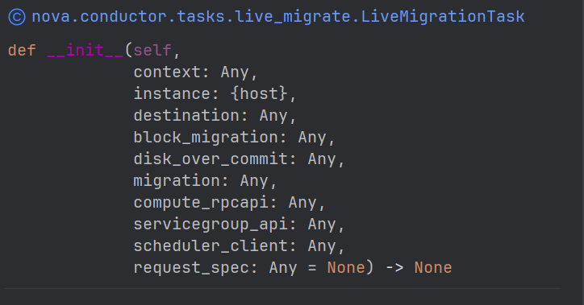
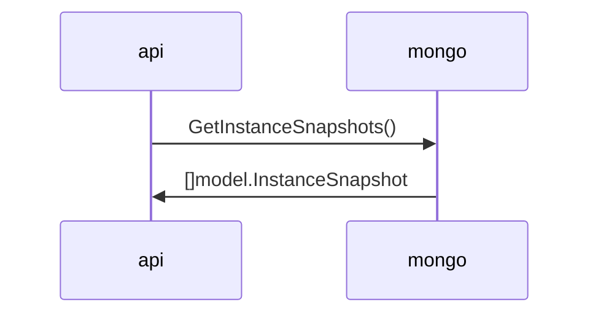
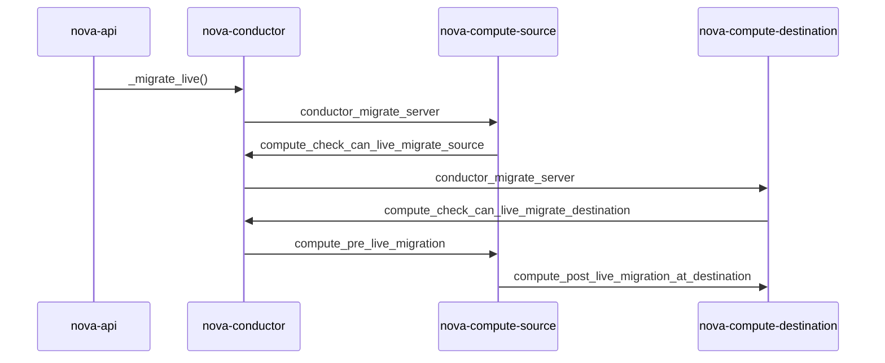

# 项目结构

```bash
nova
├── api-guide        # 包含 Nova API 的使用指南文档。
├── api-ref          # 包含 Nova API 参考文档，通常为自动生成的 REST API 文档。
├── contrib          # 包含贡献者添加的代码或模块，可能是一些实验性功能或是社区贡献的功能。
├── devstack         # 包含用于快速设置开发环境的脚本和配置文件，通常是通过 DevStack 工具。
├── doc              # 包含项目的各种文档，可能是开发者文档、设计文档等。
├── etc              # 包含配置文件模板，这些文件是运行 Nova 所必需的。
├── gate             # 包含用于执行自动化测试的脚本和配置，特别是与 CI/CD 流程相关的部分。
├── nova             # 包含 Nova 的主要源代码，这是项目的主代码库。
│   ├── api                # 包含 API 的实现代码，处理来自用户的 HTTP 请求。
│   ├── cells              # 实现 Cells v2 功能的代码，Cells 是一种用于水平扩展 Nova 的机制。
│   ├── cmd                # 包含启动不同 Nova 组件（如 nova-api, nova-compute）的命令行脚本。
│   ├── common             # 包含多个模块共享的通用代码或工具函数。
│   ├── compute            # 包含与计算节点相关的逻辑，负责虚拟机的生命周期管理。
│   ├── conductor          # 包含 Conductor 服务的实现，Conductor 负责协调多个计算节点之间的任务。
│   ├── conf               # 包含配置文件模板或配置项定义，用于指导 Nova 的行为。
│   ├── console            # 包含控制台代理服务的代码，提供用户通过 VNC 或其他协议访问实例的能力。
│   ├── consoleauth        # 包含控制台认证服务的代码，验证用户对控制台访问的权限。
│   ├── db                 # 包含数据库访问层的代码，负责与 Nova 使用的数据库进行交互。
│   ├── hacking            # 包含开发指南、代码风格检查规则等，帮助贡献者遵循项目规范。
│   ├── image              # 包含与镜像服务（Glance）交互的代码，用于管理虚拟机的镜像。
│   ├── ipv6               # 包含与 IPv6 地址管理有关的代码。
│   ├── keymgr             # 包含密钥管理服务的接口，用于加密相关操作。
│   ├── localdisk          # 包含与本地磁盘操作相关的代码。
│   ├── locale             # 包含国际化和本地化资源，支持多语言。
│   ├── network            # 包含网络服务的代码，负责管理虚拟机的网络连接。
│   ├── notifications      # 包含事件通知机制的代码，用于记录系统中发生的事件。
│   ├── objects            # 包含 Nova 中使用的所有对象模型，通常是指数据库表对应的 ORM 模型。
│   ├── pci                # 包含 PCI 设备管理的相关代码，用于直通或 SR-IOV 等功能。
│   ├── policies           # 包含策略引擎的代码，定义了哪些用户可以执行哪些操作。
│   ├── privsep            # 包含特权分离的代码，允许某些需要更高权限的操作在更安全的环境中执行。
│   ├── scheduler          # 包含调度器的实现，决定新实例应该被放置在哪一个计算节点上。
│   ├── servicegroup       # 包含服务组管理的代码，用于监控 Nova 服务的状态。
│   ├── tests              # 包含单元测试、集成测试和其他类型的测试代码。
│   ├── vendor             # 包含外部依赖库或供应商提供的代码，有时是为了解决特定版本兼容性问题而保留的。
│   ├── virt               # 包含虚拟化驱动程序的代码，负责与不同的 hypervisor 进行交互。
│   ├── vnc                # 包含 VNC 访问的支持代码，使得用户可以通过 VNC 协议访问实例的控制台。
│   └── volume             # 包含卷服务的代码，负责管理持久存储卷，通常与 Cinder 集成。
├── placement-api-ref# 包含 Placement API 的参考文档，Placement 是负责资源追踪的服务。
├── playbooks        # 包含 Ansible Playbook 或类似的配置管理剧本，用于部署或维护操作。
├── releasenotes     # 包含版本发布说明，记录了每次版本更新的内容、改进和已知问题。
├── tools            # 包含各种工具脚本，如构建、测试或其他辅助工具。
└── venv             # 包含虚拟环境配置，用于隔离 Python 环境，确保依赖项正确安装。
```

# `nova`命令

```bash
 nova [flag...] <subcommand> 

Command-line interface to the OpenStack Nova API.

Positional arguments:
  <subcommand>
    add-secgroup                Add a Security Group to a server.
    agent-create                Create new agent build.
    agent-delete                Delete existing agent build.
    agent-list                  List all builds.
    agent-modify                Modify existing agent build.
    aggregate-add-host          Add the host to the specified aggregate.
    aggregate-create            Create a new aggregate with the specified
                                details.
    aggregate-delete            Delete the aggregate.
    aggregate-list              Print a list of all aggregates.
    aggregate-remove-host       Remove the specified host from the specified
                                aggregate.
    aggregate-set-metadata      Update the metadata associated with the
                                aggregate.
    aggregate-show              Show details of the specified aggregate.
    aggregate-update            Update the aggregate's name and optionally
                                availability zone.
    attach-usb-device
    availability-zone-list      List all the availability zones.
    backup                      Backup a server by creating a 'backup' type
                                snapshot.
    bind-keypair
    boot                        Boot a new server.
    cell-capacities             Get cell capacities for all cells or a given
                                cell.
    cell-show                   Show details of a given cell.
    cgroup-cpu-show             show cgroup vcpu of server for a tenant or a
                                server. only specify <instance_uuid> or
                                <tenant_id>.
    cgroup-cpu-update           update cgroup vcpu of server for a tenant or a
                                server. only specify <instance_uuid> or
                                <tenant_id>.
    clear-password              Clear the admin password for a server from the
                                metadata server. This action does not actually
                                change the instance server password.
    clone                       Clone a server.
    console-log                 Get console log output of a server.
    dedicated-cloud-add-host    Add the host to the specified dedicated cloud.
    dedicated-cloud-available-host-list
                                Print a list of available host for dedicated
                                cloud.
    dedicated-cloud-create      Create a new dedicated cloud with the
                                specified details.
    dedicated-cloud-delete      Delete the dedicated cloud.
    dedicated-cloud-host-list   Print a list of all hosts in dedicated cloud.
    dedicated-cloud-host-show   Show details of the specified host in
                                dedicated cloud.
    dedicated-cloud-host-statistics
                                Count the resources of all hosts.
    dedicated-cloud-host-update
                                Update the dedicated cloud's display name or
                                cpu ratio or auto deployed.
    dedicated-cloud-list        Print a list of all dedicated clouds.
    dedicated-cloud-remove-host
                                Remove the specified host from the specified
                                dedicated cloud.
    dedicated-cloud-server-boot
                                Boot a new server.
    dedicated-cloud-server-list
                                List servers in dedicated cloud.
    dedicated-cloud-server-show
                                Show details about the given server in
                                dedicated cloud.
    dedicated-cloud-show        Show details of the specified dedicated cloud.
    dedicated-cloud-update      Update the dedicated cloud's name.
    dedicated-host-create       Create a dedicated host.
    dedicated-host-delete       Delete the dedicated host.
    dedicated-host-list         Print a list of all dedicated hosts.
    dedicated-host-show         Display the details of the dedicated host.
    delete                      Immediately shut down and delete specified
                                server(s).
    detach-usb-device
    diagnostics                 Retrieve server diagnostics.
    disk-qoses                  Get disk qos for a server.
    estimate-migration-time
    evacuate                    Evacuate server from failed host.
    extra-specs                 Show details about the given server.
    flavor-access-add           Add flavor access for the given tenant.
    flavor-access-list          Print access information about the given
                                flavor.
    flavor-access-remove        Remove flavor access for the given tenant.
    flavor-create               Create a new flavor.
    flavor-delete               Delete a specific flavor
    flavor-key                  Set or unset extra_spec for a flavor.
    flavor-list                 Print a list of available 'flavors' (sizes of
                                servers).
    flavor-show                 Show details about the given flavor.
    flavor-tag-add              Add one or more tags to a flavor.
    flavor-tag-delete           Delete one or more tags from a flavor.
    flavor-update               Update the description of an existing flavor.
                                (Supported by API versions '2.55' -
                                '2.latest') [hint: use '--os-compute-api-
                                version' flag to show help message for proper
                                version]
    flavor-zone
    force-delete                Force delete a server.
    get-disk-qos                Get a volume disk qos for a server.
    get-mks-console             Get an MKS console to a server. (Supported by
                                API versions '2.8' - '2.latest') [hint: use
                                '--os-compute-api-version' flag to show help
                                message for proper version]
    get-password                Get the admin password for a server. This
                                operation calls the metadata service to query
                                metadata information and does not read
                                password information from the server itself.
    get-rdp-console             Get a rdp console to a server.
    get-serial-console          Get a serial console to a server.
    get-spice-console           Get a spice console to a server.
    get-vnc-console             Get a vnc console to a server.
    host-evacuate               Evacuate all instances from failed host.
    host-evacuate-live          Live migrate all instances of the specified
                                host to other available hosts.
    host-meta                   Set or Delete metadata on all instances of a
                                host.
    host-servers-migrate        Cold migrate all instances off the specified
                                host to other available hosts.
    hypervisor-extra-specs      Get hypervisor extra specs.
    hypervisor-get-ratio        Get hypervisor allocation ratio.
    hypervisor-hostinfo         Display the hostinfo of the specified
                                hypervisor.
    hypervisor-list             List hypervisors. (Supported by API versions
                                '2.0' - '2.latest') [hint: use '--os-compute-
                                api-version' flag to show help message for
                                proper version]
    hypervisor-local-disks      Get hypervisor local disks.
    hypervisor-servers          List servers belonging to specific
                                hypervisors.
    hypervisor-set-instances-limit
                                Set hypervisor instances limit.
    hypervisor-set-ratio        Set hypervisor allocation ratio.
    hypervisor-show             Display the details of the specified
                                hypervisor.
    hypervisor-stats            Get hypervisor statistics over all compute
                                nodes.
    hypervisor-uptime           Display the uptime of the specified
                                hypervisor.
    image-create                Create a new image by taking a snapshot of a
                                running server.
    instance-action             Show an action.
    instance-action-list        List actions on a server. (Supported by API
                                versions '2.0' - '2.latest') [hint: use '--os-
                                compute-api-version' flag to show help message
                                for proper version]
    instance-backup-create      Create an instance backup.
    instance-backup-delete      Delete an instance backup.
    instance-backup-force-delete
                                Force delete a instance backup.
    instance-backup-list        Get a list of instance backup.
    instance-backup-restore     Restore an instance backup to the previous
                                instance.
    instance-backup-show        Get an instance backup details.
    instance-backup-update      Update an instance backup.
    interface-attach            Attach a network interface to a server.
    interface-detach            Detach a network interface from a server.
    interface-list              List interfaces attached to a server.
    keypair-add                 Create a new key pair for use with servers.
    keypair-delete              Delete keypair given by its name. (Supported
                                by API versions '2.0' - '2.latest') [hint: use
                                '--os-compute-api-version' flag to show help
                                message for proper version]
    keypair-list                Print a list of keypairs for a user (Supported
                                by API versions '2.0' - '2.latest') [hint: use
                                '--os-compute-api-version' flag to show help
                                message for proper version]
    keypair-show                Show details about the given keypair.
                                (Supported by API versions '2.0' - '2.latest')
                                [hint: use '--os-compute-api-version' flag to
                                show help message for proper version]
    limits                      Print rate and absolute limits.
    list                        List servers.
    list-extensions             List all the os-api extensions that are
                                available.
    list-file-system            List file system for a server.
    list-secgroup               List Security Group(s) of a server.
    list-usb-devices
    live-migrate-volume-notify
    live-migration              Migrate running server to a new machine.
    live-migration-abort        Abort an on-going live migration. (Supported
                                by API versions '2.24' - '2.latest') [hint:
                                use '--os-compute-api-version' flag to show
                                help message for proper version]
    live-migration-force-complete
                                Force on-going live migration to complete.
                                (Supported by API versions '2.22' -
                                '2.latest') [hint: use '--os-compute-api-
                                version' flag to show help message for proper
                                version]
    live-resize-flavors         Get the flavors list that the server can
                                execute live resize.
    local-disks                 Get local disk for a server.
    lock                        Lock a server. A normal (non-admin) user will
                                not be able to execute actions on a locked
                                server.
    meta                        Set or delete metadata on a server.
    migrate                     Migrate a server.
    migration-list              Print a list of migrations. (Supported by API
                                versions '2.0' - '2.latest') [hint: use '--os-
                                compute-api-version' flag to show help message
                                for proper version]
    mount-file-system           Mount file system for a server.
    offline-compute-host        offline the compute host.
    pause                       Pause a server.
    quota-class-show            List the quotas for a quota class.
    quota-class-update          Update the quotas for a quota class.
                                (Supported by API versions '2.0' - '2.latest')
                                [hint: use '--os-compute-api-version' flag to
                                show help message for proper version]
    quota-defaults              List the default quotas for a tenant.
    quota-delete                Delete quota for a tenant/user so their quota
                                will Revert back to default.
    quota-show                  List the quotas for a tenant/user.
    quota-update                Update the quotas for a tenant/user.
                                (Supported by API versions '2.0' - '2.latest')
                                [hint: use '--os-compute-api-version' flag to
                                show help message for proper version]
    reboot                      Reboot a server.
    rebuild                     Shutdown, re-image, and re-boot a server.
    refresh-network             Refresh server network information.
    remove-secgroup             Remove a Security Group from a server.
    request-spec-az-show        show request spec of the server.
    request-spec-az-update      update request spec of the server.
    rescue                      Reboots a server into rescue mode, which
                                starts the machine from either the initial
                                image or a specified image, attaching the
                                current boot disk as secondary.
    reset-failed-build          Reset failed_builds for the compute host.
    reset-network               Reset network of a server.
    reset-state                 Reset the state of a server.
    resize                      Resize a server.
    resize-confirm              Confirm a previous resize.
    resize-revert               Revert a previous resize (and return to the
                                previous VM).
    restore                     Restore a soft-deleted server.
    resume                      Resume a server.
    server-group-add-member     Add the server to the specified server_group.
    server-group-create         Create a new server group with the specified
                                details.
    server-group-delete         Delete specific server group(s).
    server-group-get            Get a specific server group.
    server-group-has-enough-resources
    server-group-list           Print a list of all server groups.
    server-group-need-migrate
    server-group-remove-member  Remove the server from the specified
                                server_group.
    server-health-check         Health check for a server.
    server-migration-list       Get the migrations list of specified server.
                                (Supported by API versions '2.23' -
                                '2.latest') [hint: use '--os-compute-api-
                                version' flag to show help message for proper
                                version]
    server-migration-show       Get the migration of specified server.
                                (Supported by API versions '2.23' -
                                '2.latest') [hint: use '--os-compute-api-
                                version' flag to show help message for proper
                                version]
    server-snapshot-create      Create a server snapshot.
    server-snapshot-delete      Delete a server snapshot.
    server-snapshot-list        Print a list of server snapshots.
    server-snapshot-reset-state
                                Reset a server snapshot to the special state.
    server-snapshot-restore     Restore a server snapshot to the server.
    server-snapshot-show        Get a server snapshot details.
    server-snapshot-update      Update a server snapshot.
    server-tag-add              Add one or more tags to a server. (Supported
                                by API versions '2.26' - '2.latest') [hint:
                                use '--os-compute-api-version' flag to show
                                help message for proper version]
    server-tag-delete           Delete one or more tags from a server.
                                (Supported by API versions '2.26' -
                                '2.latest') [hint: use '--os-compute-api-
                                version' flag to show help message for proper
                                version]
    server-tag-delete-all       Delete all tags from a server. (Supported by
                                API versions '2.26' - '2.latest') [hint: use
                                '--os-compute-api-version' flag to show help
                                message for proper version]
    server-tag-list             Get list of tags from a server. (Supported by
                                API versions '2.26' - '2.latest') [hint: use
                                '--os-compute-api-version' flag to show help
                                message for proper version]
    server-tag-set              Set list of tags to a server. (Supported by
                                API versions '2.26' - '2.latest') [hint: use
                                '--os-compute-api-version' flag to show help
                                message for proper version]
    service-delete              Delete the service by UUID ID. (Supported by
                                API versions '2.0' - '2.latest') [hint: use
                                '--os-compute-api-version' flag to show help
                                message for proper version]
    service-disable             Disable the service. (Supported by API
                                versions '2.0' - '2.latest') [hint: use '--os-
                                compute-api-version' flag to show help message
                                for proper version]
    service-enable              Enable the service. (Supported by API versions
                                '2.0' - '2.latest') [hint: use '--os-compute-
                                api-version' flag to show help message for
                                proper version]
    service-force-down          Force service to down. (Supported by API
                                versions '2.11' - '2.latest') [hint: use
                                '--os-compute-api-version' flag to show help
                                message for proper version]
    service-list                Show a list of all running services. Filter by
                                host & binary.
    set-disk-qos                Set one disk qos of a server.
    set-password                Change the user password for a server.
    shelve                      Shelve a server.
    shelve-offload              Remove a shelved server from the compute node.
    show                        Show details about the given server.
    show-credit                 show credit of the server.
    ssh                         SSH into a server.
    start                       Start the server(s).
    stop                        Stop the server(s).
    suspend                     Suspend a server.
    sync                        Sync cache for an server.
    trigger-crash-dump          Trigger crash dump in an instance. (Supported
                                by API versions '2.17' - '2.latest') [hint:
                                use '--os-compute-api-version' flag to show
                                help message for proper version]
    unbind-keypair
    unlock                      Unlock a server.
    unmount-file-system         Mount file system for a server.
    unpause                     Unpause a server.
    unrescue                    Restart the server from normal boot disk
                                again.
    unshelve                    Unshelve a server.
    update                      Update some attr for a server.
    usage                       Show usage data for a single tenant.
    usage-list                  List usage data for all tenants.
    version-list                List all API versions.
    volume-attach               Attach a volume to a server.
    volume-attachments          List all the volumes attached to a server.
    volume-detach               Detach a volume from a server.
    volume-live-migrate
    volume-update               Update the attachment on the server. Migrates
                                the data from an attached volume to the
                                specified available volume and swaps out the
                                active attachment to the new volume.
    bash-completion             Prints all of the commands and options to
                                stdout so that the nova.bash_completion script
                                doesn't have to hard code them.
    help                        Display help about this program or one of its
                                subcommands.

Optional arguments:
  --version                     show program's version number and exit
  --debug                       Print debugging output.
  --os-cache                    Use the auth token cache. Defaults to False if
                                env[OS_CACHE] is not set.
  --timings                     Print call timing info.
  --os-region-name <region-name>
                                Defaults to env[OS_REGION_NAME].
  --service-type <service-type>
                                Defaults to compute for most actions.
  --service-name <service-name>
                                Defaults to env[NOVA_SERVICE_NAME].
  --os-endpoint-type <endpoint-type>
                                Defaults to env[NOVA_ENDPOINT_TYPE],
                                env[OS_ENDPOINT_TYPE] or publicURL.
  --os-compute-api-version <compute-api-ver>
                                Accepts X, X.Y (where X is major and Y is
                                minor part) or "X.latest", defaults to
                                env[OS_COMPUTE_API_VERSION].
  --endpoint-override <bypass-url>
                                Use this API endpoint instead of the Service
                                Catalog. Defaults to
                                env[NOVACLIENT_ENDPOINT_OVERRIDE].
  --profile HMAC_KEY            HMAC key to use for encrypting context data
                                for performance profiling of operation. This
                                key should be the value of the HMAC key
                                configured for the OSprofiler middleware in
                                nova; it is specified in the Nova
                                configuration file at "/etc/nova/nova.conf".
                                Without the key, profiling will not be
                                triggered even if OSprofiler is enabled on the
                                server side.
  --os-auth-type <name>, --os-auth-plugin <name>
                                Authentication type to use

See "nova help COMMAND" for help on a specific command.
```

### show

```bash
usage: nova show [flags] <server>

Show details about the given server.

Positional arguments:
  <server>          Name or ID of server.
  
Optional arguments:
  --minimal         Skips flavor/image lookups when showing servers.
  --deleted         show deleted servers (Admin only).
  --wrap <integer>  Wrap the output to a specified length, or 0 to disable.
```


### list

```bash
nova list --name janus
```

```bash
nova list [falg]

Optional arguments:
  --reservation-id <reservation-id>  Only return servers that match reservation-id.
  --ip <ip-regexp>              Search with regular expression match by IP address.
  --ip6 <ip6-regexp>            Search with regular expression match by IPv6 address.
  --name <name-regexp>          Search with regular expression match by name.
  --instance-name <name-regexp>	Search with regular expression match by server name.
  --status <status>             Search by server status, status: ACTIVE
  --flavor <flavor>             Search by flavor name or ID.
  --image <image>               Search by image name or ID.
  --host <hostname>             Search servers by hostname to which they are assigned (Admin only).
  --all-tenants [<0|1>]         Display information from all tenants (Admin only).
  --tenant [<tenant>]           Display information from single tenant (Admin only).
  --user [<user>]               Display information from single user (Admin only).
  --deleted                     Only display deleted servers (Admin only).
  --fields <fields>             Comma-separated list of fields to display. Use
                                the show command to see which fields are
                                available.
  --minimal                     Get only UUID and name.
  --sort <key>[:<direction>]    Comma-separated list of sort keys and
                                directions in the form of <key>[:<asc|desc>].
                                The direction defaults to descending if not
                                specified.
  --marker <marker>             The last server UUID of the previous page;
                                displays list of servers after "marker".
  --limit <limit>               Maximum number of servers to display. If limit
                                == -1, all servers will be displayed. If limit
                                is bigger than 'CONF.api.max_limit' option of
                                Nova API, limit 'CONF.api.max_limit' will be
                                used instead.
  --changes-since <changes_since>
                                List only servers changed after a certain
                                point of time. The provided time should be an
                                ISO 8061 formatted time. ex
                                2016-03-04T06:27:59Z .
  --tags <tags>                 The given tags must all be present for a
                                server to be included in the list result.
                                Boolean expression in this case is 't1 AND
                                t2'. Tags must be separated by commas: --tags
                                <tag1,tag2> (Supported by API versions '2.26'
                                - '2.latest')
  --tags-any <tags-any>         If one of the given tags is present the server
                                will be included in the list result. Boolean
                                expression in this case is 't1 OR t2'. Tags
                                must be separated by commas: --tags-any
                                <tag1,tag2> (Supported by API versions '2.26'
                                - '2.latest')
  --not-tags <not-tags>         Only the servers that do not have any of the
                                given tags will be included in the list
                                results. Boolean expression in this case is
                                'NOT(t1 AND t2)'. Tags must be separated by
                                commas: --not-tags <tag1,tag2> (Supported by
                                API versions '2.26' - '2.latest')
  --not-tags-any <not-tags-any>
                                Only the servers that do not have at least one
                                of the given tags will be included in the list
                                result. Boolean expression in this case is
                                'NOT(t1 OR t2)'. Tags must be separated by
                                commas: --not-tags-any <tag1,tag2> (Supported
                                by API versions '2.26' - '2.latest')
```

### live-migration

```bash
nova live-migration [flags] <server> [<host>]

Migrate running server to a new machine.

Positional arguments:
  <server>                      Name or ID of server.
  <host>                        Destination host name.

Optional arguments:
  --block-migrate               True in case of block_migration.
                                (Default=auto:live_migration) (Supported by
                                API versions '2.25' - '2.latest')
  --force                       Force to not verify the scheduler if a host is
                                provided. (Supported by API versions '2.30' -
                                '2.latest')
  --migration-type <migration-type>
                                For local storage migration to shared storage.
                                e.g. to_<volume_type_name>(see 'cinder type-
                                list'): migrate all the disks of the instance
                                to the volume.
```

### live-migration-abort

```bash
nova live-migration-abort <server> <migration>

Abort an on-going live migration. (Supported by API versions '2.24' -
'2.latest') [hint: use '--os-compute-api-version' flag to show help message
for proper version]

Positional arguments:
  <server>     Name or ID of server.
  <migration>  ID of migration.
```

### server-migration-list

```bash
[root@gz-txjs-control-55e243e31e30 ~]# nova help server-migration-list
usage: nova server-migration-list <server>

Get the migrations list of specified server. (Supported by API versions '2.23'
- '2.latest') [hint: use '--os-compute-api-version' flag to show help message
for proper version]

Positional arguments:
  <server>  Name or ID of server.
```

### migration-list

```bash
nova migration-list  --instance-uuid ae5cebfc-630d-43db-bf34-8847afbc926c --limit
```


```bash
nova migration-list [--instance-uuid <instance_uuid>] [--host <host>]
                           [--status <status>] [--marker <marker>]
                           [--limit <limit>] [--changes-since <changes_since>]

Print a list of migrations. (Supported by API versions '2.0' - '2.latest')
[hint: use '--os-compute-api-version' flag to show help message for proper
version]

Optional arguments:
  --instance-uuid <instance_uuid>
                                Fetch migrations for the given instance.
  --host <host>                 Fetch migrations for the given host.
  --status <status>             Fetch migrations for the given status.
  --marker <marker>             The last migration of the previous page;
                                displays list of migrations after "marker".
                                Note that the marker is the migration UUID.
  --limit <limit>               Maximum number of migrations to display. Note
                                that there is a configurable max limit on the
                                server, and the limit that is used will be the
                                minimum between what is requested here and
                                what is configured in the server.
  --changes-since <changes_since>
                                List only migrations changed after a certain
                                point of time. The provided time should be an
                                ISO 8061 formatted time. ex
                                2016-03-04T06:27:59Z .
```


### reset-state

```bash
nova reset-state --active janus
```

```bash
usage: nova reset-state [plags] <server> [<server> ...]

Reset the state of a server.

Positional arguments:
  <server>       Name or ID of server(s).

Optional arguments:
  --all-tenants  Reset state server(s) in another tenant by name (Admin only).
  --active       Request the server be reset to "active" state instead of
                 "error" state (the default).
  --stopped      Request the server be reset to "stopped" state
```

### instance-action-list 

```bash
nova instance-action-list  <server>
```

```bash
usage: nova instance-action-list [--marker <marker>] [--limit <limit>]
                                 [--changes-since <changes_since>]
                                 <server>

List actions on a server. (Supported by API versions '2.0' - '2.latest')
[hint: use '--os-compute-api-version' flag to show help message for proper
version]

Positional arguments:
  <server>                      Name or UUID of the server to list actions
                                for. Only UUID can be used to list actions on
                                a deleted server.

Optional arguments:
  --marker <marker>             The last instance action of the previous page;
                                displays list of actions after "marker".
  --limit <limit>               Maximum number of instance actions to display.
                                Note that there is a configurable max limit on
                                the server, and the limit that is used will be
                                the minimum between what is requested here and
                                what is configured in the server.
  --changes-since <changes_since>
                                List only instance actions changed after a
                                certain point of time. The provided time
                                should be an ISO 8061 formatted time. ex
                                2016-03-04T06:27:59Z
```

###  instance-action

```bash
nova instance-action <server> <request_id>
```

```bash
usage: nova instance-action <server> <request_id>

Show an action.

Positional arguments:
  <server>      Name or UUID of the server to show actions for. Only UUID can
                be used to show actions for a deleted server. (Supported by
                API versions '2.21' - '2.latest')
  <request_id>  Request ID of the action to get.
```

### rebuild

```bash
usage: nova rebuild [--image <image>] [--rebuild-password <rebuild-password>]
                    [--poll] [--minimal] [--preserve-ephemeral]
                    [--name <name>] [--description <description>]
                    [--meta <key=value>] [--key-name <key-name>] [--key-unset]
                    [--user-data <user-data>] [--user-data-unset]
                    [--volume <volume>]
                    <server>

Shutdown, re-image, and re-boot a server.

Positional arguments:
  <server>                      Name or ID of server.

Optional arguments:
  --image <image>               Name or ID of new image.
  --rebuild-password <rebuild-password>
                                Set the provided admin password on the rebuilt
                                server.
  --poll                        Report the server rebuild progress until it
                                completes.
  --minimal                     Skips flavor/image lookups when showing
                                servers.
  --preserve-ephemeral          Preserve the default ephemeral storage
                                partition on rebuild.
  --name <name>                 Name for the new server.
  --description <description>   New description for the server. (Supported by
                                API versions '2.19' - '2.latest')
  --meta <key=value>            Record arbitrary key/value metadata to
                                /meta_data.json on the metadata server. Can be
                                specified multiple times.
  --key-name <key-name>         Keypair name to set in the server. Cannot be
                                specified with the '--key-unset' option.
                                (Supported by API versions '2.54' -
                                '2.latest')
  --key-unset                   Unset keypair in the server. Cannot be
                                specified with the '--key-name' option.
                                (Supported by API versions '2.54' -
                                '2.latest')
  --user-data <user-data>       User data file to pass to be exposed by the
                                metadata server. (Supported by API versions
                                '2.57' - '2.latest')
  --user-data-unset             Unset user_data in the server. Cannot be
                                specified with the '--user-data' option.
                                (Supported by API versions '2.57' -
                                '2.latest')
  --volume <volume>             ID of the volume to rebuild. (Supported by API
                                versions '2.61' - '2.latest')
```

### volume-attach  

```bash
nova volume-attach janus 447522bf-5f8c-41c1-9b10-a629efac9a9c
```

```bash
usage: nova volume-attach [--tag <tag>] [--disk_bus <disk_bus>]
                          <server> <volume> [<device>]

Attach a volume to a server.

Positional arguments:
  <server>               Name or ID of server.
  <volume>               ID of the volume to attach.
  <device>               Name of the device e.g. /dev/vdb. Use "auto" for
                         autoassign (if supported). Libvirt driver will use
                         default device name.

Optional arguments:
  --tag <tag>            Tag for the attached volume. (Supported by API
                         versions '2.49' - '2.latest')
  --disk_bus <disk_bus>  Disk bus for the attached volume, can be chosen from
                         ide, sata,scsi, virtio and etc. (Supported by API
                         versions '2.49' - '2.latest')
```

### backup

```bash
nova backup janus janus daily 3
```

```bash
nova backup <server> <name> <backup-type> <rotation>

Backup a server by creating a 'backup' type snapshot.

Positional arguments:
  <server>       Name or ID of server.
  <name>         Name of the backup image.
  <backup-type>  The backup type, like "daily" or "weekly".
  <rotation>     Int parameter representing how many backups to keep around.
```

### instance-backup-list

```bash
nova instance-backup-list [flag...]

Get a list of instance backup.

Optional arguments:
  --all-tenants [<0|1>]      List instance backup for all tenants (Admin
                             only).
  --instance-id INSTANCE_ID  List instance backup for the instance.

```

### volume-attachments

```bash
 nova volume-attachments e057d497-bcc3-4fb2-9804-8bac4332378d
```


```bash
nova volume-attachments <server>

List all the volumes attached to a server.

Positional arguments:
  <server>  Name or ID of server.
```

### rescue 

```bash
Reboots a server into rescue mode, which starts the machine from either the
initial image or a specified image, attaching the current boot disk as
secondary.

Positional arguments:
  <server>               Name or ID of server.

Optional arguments:
  --password <password>  The admin password to be set in the rescue
                         environment.
  --image <image>        The image to rescue with.
```

## snapshot

server-snapshot-create      Create a server snapshot.
server-snapshot-delete      Delete a server snapshot.
server-snapshot-list        Print a list of server snapshots.
server-snapshot-reset-state
                            Reset a server snapshot to the special state.
server-snapshot-restore     Restore a server snapshot to the server.
server-snapshot-show        Get a server snapshot details.
server-snapshot-update      Update a server snapshot.

### server-snapshot-list

```bash
nova server-snapshot-list [optinal...]

Print a list of server snapshots.

Optional arguments:
  --instance-uuid <instance_uuid>
                                Fetch snapshots for the given instance.
  --state <state>               Display snapshots in the specific state.
  --all-tenants [<0|1>]         Display snapshots from all tenants (Admin
                                only).
  --invisible [<0|1>]           Whether to display the invisible snapshots.
  --marker <marker>             The last snapshot of the previous page;
                                displays list of snapshots after "marker".
                                Note that the marker is the snapshot UUID.
  --limit <limit>               Maximum number of snapshots to display. Note
                                that there is a configurable max limit on the
                                server, and the limit that is used will be the
                                minimum between what is requested here and
                                what is configured in the server.
  --sort-key <sort-key>         Snapshot list sort key.
  --sort-dir <sort-dir>         Snapshot list sort direction.
```

### server-snapshot-create

```bash
nova server-snapshot-create 5ae06825-0722-4920-93c3-1b7f3b042793 janus
```

```bash
nova server-snapshot-create [flag...] <instance_id> <name>

Create a server snapshot.

Positional arguments:
  <instance_id>                 ID of the instance to snapshot.
  <name>                        Name of server snapshot.

Optional arguments:
  --description <description>   Description of server snapshot.
  --force-consistency <force-consistency>
                                Whether to force create a consistent snapshot,
                                if set to true creating will fail if guest fs
                                freeze failed and block storage consistent
                                snapshot failed.
```

### server-snapshot-show

```ba
nova server-snapshot-show <server_snapshot_id>

Get a server snapshot details.

Positional arguments:
  <server_snapshot_id>  ID of the server snapshot to show.

```

### server-snapshot-delete

```bash
nova server-snapshot-delete <server_snapshot> [<server_snapshot> ...]

Delete a server snapshot.

Positional arguments:
  <server_snapshot>  ID(s) of the server snapshot to delete.

```


# 组件

nova-api

    作用：接收和处理来自用户的API请求。
    通信方式：通过消息队列与其他Nova服务通信，如 nova-conductor 和 nova-scheduler。

nova-compute

    作用：负责实例的实际创建、管理和销毁。
    通信方式：通过消息队列与 nova-conductor 通信，并可能与 nova-network 和其他计算节点通信。

nova-conductor

    作用：充当计算节点和其他Nova服务之间的中介，减少直接数据库访问，提高性能和安全性。
    通信方式：通过消息队列与 nova-compute 和 nova-api 通信。

nova-scheduler

    作用：选择最适合运行新实例的计算节点。
    通信方式：通过消息队列与 nova-conductor 和 nova-api 通信。

# 业务

## 热迁流程

1. pre_live_migration 阶段：

   ​	热迁移前的准备阶段，主要在目的计算节点上提前准备虚拟机资源，包括网络资源，例如：建立虚拟机的网卡，然后将网卡加入 OvS br-int 网桥。如果该阶段失败，会有回滚操作。

   - _migrate_live	nova/api/openstack/compute/migrate_server.py 

   - live_migrate	  nova/compute/api.py

   - live_migrate_instance	nova/conductor/api.py

     - 同步：live_migrate_instance	nova/conductor/manager.py
       - _live_migrate
       - _execute	nova/conductor/tasks/live_migrate.py
       - live_migration	nova/compute/rpcapi.py
       - live_migration	nova/compute/manager.py
     - 异步
     
     

2. 内存迁移阶段：

   ​	该阶段完全虚拟机虚拟内存数据的迁移，如果虚拟机的系统盘在计算节点本地，那么系统盘数据也会在此时进行迁移。如果该阶段失败，会有回滚操作，回滚流程和 pre_live_migration 阶段一致。

3. post_live_migration 阶段：

   ​	热迁移完成后资源清理阶段，源计算节点主要是断开源计算节点上虚拟机的卷连接、清理源计算节点虚拟机的网卡资源；目的节点主要是调用 neutronclient，更新 Port Host 属性为目的计算节点。(NOTE：该阶段无需回滚流程，因为虚拟机实际上已经成功迁移，再回滚没有意义）

   



````bash
参与者:
- User (用户)
- Nova API
- Nova Conductor
- Nova Scheduler (可选)
- Nova Compute (源主机)
- Nova Compute (目标主机)
- Database

时序:
1. User -> Nova API: 发起热迁移请求
2. Nova API -> Nova API: 验证请求
3. Nova API -> Nova Conductor: 通过消息队列发送迁移请求
4. Nova Conductor -> Nova Conductor: 检查目标主机资源
5. Nova Conductor -> Nova Scheduler: 选择目标主机 (可选)
6. Nova Scheduler -> Nova Conductor: 返回目标主机信息 (可选)
7. Nova Conductor -> Nova Compute (源主机): 通过消息队列发送迁移指令
8. Nova Compute (源主机) -> Nova Compute (目标主机): 建立连接，同步虚拟机状态
9. Nova Compute (源主机) -> Nova Compute (目标主机): 逐步复制内存状态
10. Nova Compute (目标主机) -> Nova Compute (目标主机): 激活虚拟机
11. Nova Compute (目标主机) -> Nova Conductor: 通知迁移完成
12. Nova Conductor -> Database: 更新虚拟机位置信息
13. Nova Conductor -> Nova Compute (源主机): 通知源主机释放资源
14. Nova Compute (源主机) -> Nova Compute (源主机): 释放虚拟机资源
15. Nova Compute (源主机) -> Nova Conductor: 通知资源已释放
16. Nova Conductor -> Nova API: 通过消息队列通知迁移结果
17. Nova API -> User: 反馈迁移结果
```
````

```bash
# 参与者
- User (用户)
- Nova API
- Nova Conductor
- Nova Compute (源主机)
- Nova Compute (目标主机)
- Database

# 时序
1. **User -> Nova API**: 发起热迁移请求
2. **Nova API -> Nova API**: 验证请求
3. **Nova API -> Nova Conductor**: 通过消息队列发送迁移请求
4. **Nova Conductor -> Nova Conductor**: 检查目标主机资源
5. **Nova Conductor -> Nova Scheduler**: 选择目标主机 (可选)
6. **Nova Scheduler -> Nova Conductor**: 返回目标主机信息 (可选)
7. **Nova Conductor -> Nova Compute (源主机)**: 通过消息队列发送迁移指令
8. **Nova Compute (源主机) -> Nova Compute (目标主机)**: 建立连接，同步虚拟机状态
9. **Nova Compute (源主机) -> Nova Compute (目标主机)**: 逐步复制内存状态
10. **Nova Compute (目标主机) -> Nova Compute (目标主机)**: 激活虚拟机
11. **Nova Compute (目标主机) -> Nova Conductor**: 通知激活失败
12. **Nova Conductor -> Nova Conductor**: 记录错误日志，开始回滚过程
13. **Nova Conductor -> Nova Compute (源主机)**: 通过消息队列通知源主机开始回滚
14. **Nova Compute (源主机) -> Nova Compute (源主机)**: 恢复虚拟机状态
15. **Nova Compute (源主机) -> Nova Compute (源主机)**: 重新启动虚拟机
16. **Nova Compute (源主机) -> Nova Conductor**: 通知虚拟机已恢复
17. **Nova Conductor -> Nova Compute (目标主机)**: 通过消息队列通知目标主机清理资源
18. **Nova Compute (目标主机) -> Nova Compute (目标主机)**: 清理临时资源
19. **Nova Compute (目标主机) -> Nova Conductor**: 通知资源已清理
20. **Nova Conductor -> Database**: 更新虚拟机位置信息
21. **Nova Conductor -> Nova API**: 通过消息队列通知迁移失败并已回滚
22. **Nova API -> User**: 反馈迁移失败并已回滚的结果
```

## 查询快照列表



```go
入参：
type QueryInstanceSnapshots struct {
    Skip             uint   
    Limit            uint  
    Name             string 
    UserId           string 
    ProjectId        string 
    Marker           string 
    Invisible        bool   
    Status           string
    ForceConsistency bool  
}

出参：
type InstanceSnapshot struct {
    InstanceSnapshotId string                 
    Name               string                 
    Description        string                 
    InstanceId         string                 
    ProjectId          string                 
    UserId             string                 
    Status             InstanceSnapshotStatus 
    ErrorCode          int                    
    Invisible          bool                   
    ForceConsistency   bool                 
    IsFrozen           bool                 
    StateInfo          string               
    CreatedAt          int64                
    UpdatedAt          int64                
    Members            []Members           
    Size               int                  
    Version            Version        
}
```


# 热迁

## 流程图



```bash
+---------------+------------------------------------------------------------+
| Property      | Value                                                      |
+---------------+------------------------------------------------------------+
| action        | live-migration                                             |
| events        | [{u'event': u'compute_post_live_migration_at_destination', |
|               |   u'finish_time': u'2024-12-16T15:15:13.000000',           |
|               |   u'result': u'Success',                                   |
|               |   u'start_time': u'2024-12-16T15:15:05.000000',            |
|               |   u'traceback': None},                                     |
|               |  {u'event': u'compute_pre_live_migration',                 |
|               |   u'finish_time': u'2024-12-16T15:14:53.000000',           |
|               |   u'result': u'Success',                                   |
|               |   u'start_time': u'2024-12-16T15:14:51.000000',            |
|               |   u'traceback': None},                                     |
|               |  {u'event': u'compute_check_can_live_migrate_destination', |
|               |   u'finish_time': u'2024-12-16T15:14:49.000000',           |
|               |   u'result': u'Success',                                   |
|               |   u'start_time': u'2024-12-16T15:14:51.000000',            |
|               |   u'traceback': None},                                     |
|               |  {u'event': u'compute_live_migration',                     |
|               |   u'finish_time': u'2024-12-16T15:14:50.000000',           |
|               |   u'result': u'Success',                                   |
|               |   u'start_time': u'2024-12-16T15:14:50.000000',            |
|               |   u'traceback': None},                                     |
|               |  {u'event': u'compute_check_can_live_migrate_source',      |
|               |   u'finish_time': u'2024-12-16T15:14:51.000000',           |
|               |   u'result': u'Success',                                   |
|               |   u'start_time': u'2024-12-16T15:14:49.000000',            |
|               |   u'traceback': None},                                     |
|               |  {u'event': u'conductor_migrate_server',                   |
|               |   u'finish_time': u'2024-12-16T15:14:50.000000',           |
|               |   u'result': u'Success',                                   |
|               |   u'start_time': u'2024-12-16T15:14:48.000000',            |
|               |   u'traceback': None}]                                     |
| instance_uuid | f7f35b85-d625-4afd-91af-ec26d163625c                       |
| message       | -                                                          |
| project_id    | 28e5517d27ea4e568b3d5cfd6dd625f8                           |
| request_id    | req-58a7dac2-eca9-4375-b0cc-08eef538246e                   |
| start_time    | 2024-12-16T15:14:47.000000                                 |
| updated_at    | 2024-12-16T15:15:13.000000                                 |
| user_id       | 6dc03c066d3149e5b19baeb92948a755                           |
+---------------+------------------------------------------------------------+
```

